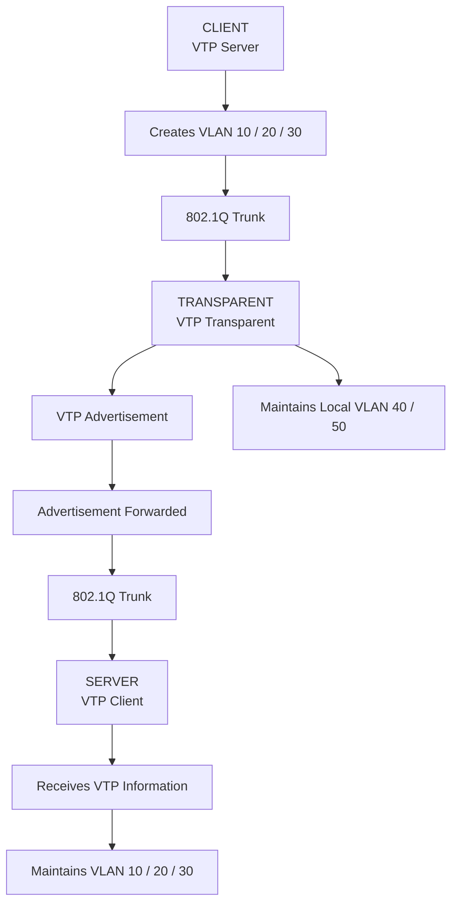

# 🧪 VTP Transparent Mode Lab
 
## 🎯 Objective
 
Configure a Cisco switching topology using VTP Transparent mode 
to understand VTP Server, Client, and Transparent modes, VLAN 
database independence, VTP advertisement forwarding, and 
802.1Q trunking.
 
## 🖥️ Topology 
 
CLIENT ─── TRANSPARENT ─── SERVER
 
**CLIENT:** VLAN 10, VLAN 20, VLAN 30  
**TRANSPARENT:** VLAN 40, VLAN 50  
**SERVER:** VLAN 10, VLAN 20, VLAN 30

<br>
<br>
<br>


 <br>
 <br>
 <br>
 🌐 VLAN Configuration 
 
| Device | VLANs | VTP Mode |
|---|---|---|
| CLIENT | VLAN 10, 20, 30 | Server |
| TRANSPARENT | VLAN 40, 50 | Transparent |
| SERVER | VLAN 10, 20, 30 | Client |
 
## 🔧 Technologies 
 
- Cisco IOS
- VTP
- VTP Server Mode
- VTP Client Mode
- VTP Transparent Mode
- 802.1Q Trunking
- VLAN
- Layer 2 Switching
- MAC Address Table
 
## ⚙️ VTP Configuration 
 
### CLIENT
 
**VTP Mode:** Server
 
The CLIENT switch operates in **VTP Server mode** and maintains 
the VLAN database for:
 
```text
VLAN 10
VLAN 20
VLAN 30
````


### TRANSPARENT

**VTP Mode:** Transparent

The TRANSPARENT switch maintains its **own local VLAN database**.

Locally configured VLANs:

```text
VLAN 40
VLAN 50
```

The switch does not synchronize its local VLAN database with
the VTP Server.


### SERVER

**VTP Mode:** Client

The SERVER switch operates in **VTP Client mode** and receives
VLAN information through VTP advertisements.

Expected VLANs:

```text
VLAN 10
VLAN 20
VLAN 30
```


## 🔗 Trunk Configuration

The inter-switch links are configured as **802.1Q trunk links**.

```text
CLIENT
   |
   | 802.1Q Trunk
   |
TRANSPARENT
   |
   | 802.1Q Trunk
   |
SERVER
```

The trunk links allow multiple VLANs to traverse a single
physical connection.

## 🔍 Verification

### VTP Status

Verify the VTP mode on each switch using:


Expected:

```text
CLIENT        → Server
TRANSPARENT   → Transparent
SERVER        → Client
```

### VLAN Database

Verify the configured VLANs using:

```text
show vlan brief
```

Expected:

```text
CLIENT        → VLAN 10, 20, 30
TRANSPARENT   → VLAN 40, 50
SERVER        → VLAN 10, 20, 30


```

### Trunk Verification

Verify the trunk interfaces using:

```text
show interfaces trunk
```


The inter-switch interfaces should operate as **802.1Q trunks**.

### VTP Information

Verify the following information using:


* VTP Domain
* VTP Mode
* VTP Version
* Configuration Revision


## 📊 VTP Communication Process

### VTP Transparent Operation



## 📌 VTP Transparent Behavior

The TRANSPARENT switch behaves differently from a VTP Client.

It:

* Maintains its **own local VLAN database**.
* Does **not synchronize** its VLAN database with the VTP Server.
* Allows **local VLAN creation**.
* Maintains locally configured VLANs such as **VLAN 40 and VLAN 50**.
* Forwards VTP advertisements through trunk links when applicable.

## 🧪 VLAN Database Verification

### CLIENT

```text
show vlan brief
```

Expected VLANs:

```text
10
20
30
```

### TRANSPARENT

```text
show vlan brief
```

Expected VLANs:

```text
40
50
```

### SERVER

```text
show vlan brief
```

Expected VLANs:

```text
10
20
30
```

## 🧠 Key Learning

* VTP Server mode
* VTP Client mode
* VTP Transparent mode
* VTP VLAN synchronization
* VLAN database independence
* VTP advertisement forwarding
* 802.1Q trunking
* Local VLAN creation
* VLAN database verification
* Layer 2 switching

## ✅ Result

The topology successfully demonstrates **VTP Transparent mode**.

The TRANSPARENT switch maintains its own local VLAN database
containing **VLAN 40 and VLAN 50** instead of synchronizing its
local VLAN database with the VTP Server.

The inter-switch links operate as **802.1Q trunks**, allowing
VTP advertisements to traverse the switching topology.

The lab demonstrates how **VTP Server, Client, and Transparent
modes handle VLAN information differently**.


```
```
